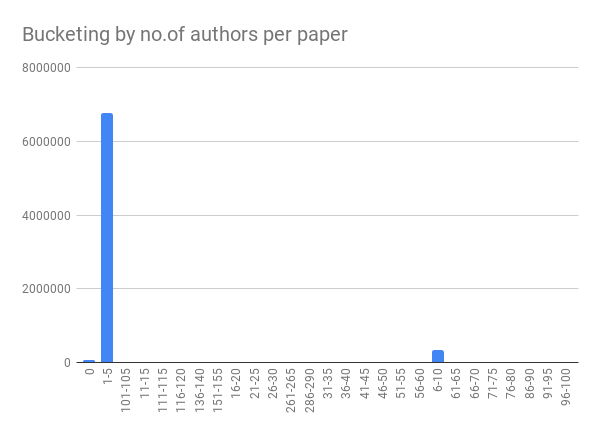
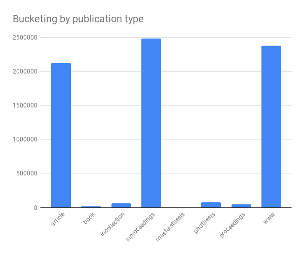

CS441 - Homework 2
---
Homework 2: To gain experience with the map-reduce computation model by performing various statistical analyses on publication data distributed in a dblp.xml file.
---
Name : Abhijeet Mohanty
---
### Overview

* In this homework, I have created a sequence of Hadoop MapReduce jobs which perform various analysis tasks, be it sorting, computing cumulative statistics or bucketing based on some key indicators based on the publication data provided through the dblp.xml file. Then I learn how to deploy my jobs packaged in a JAR by utilizing AWSs’ cloud infrastructure services for storage and for running map reduce jobs through their S3 and EMR offering. A small demo of my Apache Hadoop MapReduce execution on AWS EMR can be found on this [can be found on this link](https://www.youtube.com/watch?v=b1tG-iEXS-Y&t=1092s).  

### Setup information

* Hypervisor: VMWare Fusion Professional Version 11.0.0
* Guest OS:  CentOS
* Local development IDE: IntelliJ IDEA 2018.1
* Language: Scala v2.12.8
* Build tool: Simple build tool (SBT) v1.1.2 

### Steps to follow to set up the execution environment

* After cloning the project titled **abhijeet_mohanty_cs441_hw2** navigate to **abhijeet_mohanty_cs441_hw2/publication-statistics-computation** and run the following command to clean, compile and build the JAR
    
    `> sbt clean compile assembly`

* Make sure HDP sandbox is booted up on a distribution of VMWare.

* Next, we need to copy the dblp.xml of to the Hadoop file system as below :

    
    `> scp -P 2222 <local path to dblp.xml> root@sandbox-hdp.hortonworks.com:~/`
    

* Next, we need to copy the artifact JAR generated as `abhijeet_mohanty_cs441_hw2/publication-statistics-computation/target/scala-2.12/publication-statistics-computation-assembly-0.1.jar` into the Hadoop file system as below
    
    
    `> scp -P 2222 <local path to executable JAR> root@sandbox-hdp.hortonworks.com:~/`
    

* Next, we to do a secure login into the sandbox as root 
    
    
    `> ssh -p 222 root@sandbox-hdp.hortonworks.com`
    

* Next, we need to make a directory where `dblp.xml` would be placed  
    
    
    `> hdfs dfs -mkdir <input path to dblp.xml>`
    

* Next, we put the `dblp.xml` file in the directory we created in the preceding step 
    
    
    `> hdfs dfs -put <input path to dblp.xml>/`
    

* Executing the JAR
    
    
    `> hadoop jar <input path to executable JAR> <input path to dblp.xml>`

* Viewing the results

    * In order to construct the output path, I take the `<hdfs path to dblp.xml>/` and append the following based on the type of my map-reduce job.

        * Possible output paths
    
            * Parent of `<input path to dblp.xml>/` appended with `/sort_result/`
    
            * Parent of `<input path to dblp.xml>/` appended with `/bucketing_by_num_coauthor_result/`
    
            * Parent of `<input path to dblp.xml>/` appended with `/bucketing_by_publication_type_result/`
    
            * Parent of `<input path to dblp.xml>/` appended with `/authorship_score_result/`
    
            * Parent of `<input path to dblp.xml>/` appended with `/mean_median_max_result/`
            
        * **NOTE :** For example, upon running on AWS EMR, a `user` folder was the parent folder and the result folders were created within it.   


### Map-Reduce job descriptions

* Bucketing

    * By the no. of co-authors per paper
        * In this task, `BucketingByNumNodesMapper` buckets in a manner such that each bucket represents a range of the no. of co-authors and the value computed for this bucket is the no. of such publications.
        * Here the `bucketSize` can be configured through the `application.conf` file.
    * By publication type
        * In this task, `BucketingByNumNodesMapper` in a manner such that each bucket represents the publication type, say for instance the publication type could be a PhD thesis, an article or a proceeding and so on. The value corresponding to each such bucket is simply the no. of instances a publication type appears in our dbpl.xml input.

* Authorship score

    * In this task, `AuthorshipScoreMapper` computes the authorship score corresponding to a given author across all publications he/ she publishes.
    * The `AuthorshipScoreReducer` reduces each key by adding the authorship score generated for each publication by adding across all publications for that author.
    * I have used the following algorithm to compute the authorship score.
    * Create a list of all authors responsible for a publication such that it’s ordering preserves the ordering mentioned in the dblp.xml file.
        * Assign each author a score of 1/N where N denotes the no. of co-authors for the publication being processed.
        * Iteratively, in reverse order of the co-authors, take away (¼)th of the score assigned and add it to the score of the immediate preceding co-author and so on until the first author is reached.
        * By the above algorithm, each author receives a different score such that upon sorting the scores in descending order, the rank of the authors is the same as that specified for the publication specified in the dblp.xml file input.

* Max median and average

    * In this task, I compute the maximum, median and average no. of co-authors for an author across all his/ her publications.
    * Here I make use of a composite writable class, `MaxMedianAvgWritable` which encapsulates 4 data members `(max, count, median, avg)`.
    * As far as each map operation is concerned, `MaxMedianAvgMapper` emits total no. of co-authors, 1, the total no. of co-authors, the total no. of co-authors as initialization values for the 4 aforementioned data members respectively.
    * In each reduce step, I aggregate the counts and the values by running through an iterable of values as emitted by all my reducers. 
    * To compute my average, I aggregate my count and all averages and divide aggregated averages and the count.
    * To compute my max, I determine my maximum max across all my iterables.
    * To compute my median, I add all emitted medians to a list, sort it and determine the middle value in my list.
    
* Sorting

    * In this task, I sort in descending order, the max no. of unique co-authors a particular author has worked with across all his/ her publications.
    * To achieve my goal, I make use of a pair of map reduce jobs wherein the first job emits the count of total unique co-authors an author has worked with.
    * The second job, simply inverts the key and value pairs i.e from `(author -> no. of unique co-authors)` to `(no. of unique co-authors -> author)`. The emitted key-value pairs undergo a sort and shuffle step based on the key element. 
    * In order to customize this sort and shuffle step, I have written a `DescendingOrderByNumCoAuthorComparator` which sorts in descending order by the no. of unique co-authors. The secondary reducer further inverts the key-value pairs it receives so that the final output is of the form `(author -> no. of unique co-authors)`

### Visualization of analyzed data through histograms

* In order to achieve this goal, I simply download my output files generated from map-reduce jobs concerning bucketing (by no. of co-authors and by publication type)
* I rename the downloaded result file by appending a .csv extension and by importing the data into a Google Sheet document.
* Then I generate a chart to view the resultant visualization.

* Results

    * Bucketing by the no. of co-authors
    
```
       0	52757
       1-5	6767291
       101-105	5
       11-15	17507
       111-115	2
       116-120	2
       136-140	1
       151-155	1
       16-20	3302
       21-25	1089
       26-30	497
       261-265	1
       286-290	2
       31-35	218
       36-40	122
       41-45	69
       46-50	48
       51-55	30
       56-60	26
       6-10	324185
       61-65	9
       66-70	9
       71-75	7
       76-80	6
       86-90	1
       91-95	3
       96-100	2 
```
 
 
   
   * Bucketing by publication type
 
```
    article	2121150
    book	17800
    incollection	59952
    inproceedings	2478509
    mastersthesis	12
    phdthesis	73914
    proceedings	42243
    www	2373612
```  
 
 
       

### Other results

* Sorting by the no. of unique co-authors in descending order


```
    Wei Wang	3268
    Wei Li	3078
    Wei Zhang	3053
    Yang Liu	2700
    Lei Wang	2687
    Lei Zhang	2605
    Yu Zhang	2499
    Jing Li	2468
    Jun Wang	2357
    Jing Wang	2312
    Li Zhang	2288
    Xin Wang	2232
    Yan Li	2220
    Wei Chen	2135
    Yan Zhang	2103
    Yang Li	2047
    Li Li	2001
    Wei Liu	1993
    Hui Li	1970
    Jian Wang	1962
    Yi Zhang	1929
    Xin Li	1928
    Yang Yang	1912
    Jing Zhang	1909
    Yan Wang	1879
    Jian Zhang	1773
    Yong Wang	1767
    Ying Li	1766
    Jun Zhang	1763
    Ying Wang	1755
    Jie Zhang	1755
    Xiang Li	1695
    Li Wang	1690
    Xin Liu	1658
    Hao Wang	1658
    Jun Li	1657
    Tao Wang	1645
    Xi Chen	1638
    Ying Zhang	1616
    Hui Wang	1602
    Jian Li	1600
    Peng Wang	1580
    Jing Liu	1575
    Yi Wang	1562
    Bo Li	1560
    Fan Zhang	1548
    Yu Liu	1536
    Jie Li	1525
    Xin Zhang	1519
    Bin Li	1506
    Yong Zhang	1475
    Qi Wang	1462
    Tao Zhang	1456
    Yang Zhang	1455
    Yang Wang	1454
    Chao Wang	1439
    Wei Wu	1439
    Rui Zhang	1416
    Jie Liu	1413
    Yu Wang	1411
    Peng Li	1408
    Ying Liu	1403
    Yong Liu	1402
    Fan Yang	1399
    Ming Li	1397
    Hao Zhang	1390
    Bin Wang	1385
    Hui Zhang	1382
    Hao Li	1378
    Qiang Wang	1369
``` 


* Max, median and average

    * A small sample of max, median and average of co-authors worked with for a given author
    
```
    R. Manokaran	;5.0;5;3.3333333
    R. Manonmani	;47.0;3;16.666666
    R. Manzanares	;10.0;0;5.0
    R. Marc Lebel	;59.0;6;13.428572
    R. Maree	;3.0;0;1.5
    R. Maresca	;4.0;0;2.0
    R. Marinho	;3.0;2;1.6666666
    R. Marini	;6.0;0;3.0
    R. Marion	;2.0;0;1.0
    R. Mark Chilenskas	;4.0;3;2.5
    R. Mark Greenwood	;60.0;4;6.58
```
* Authorship score


```
    A Dewdney	1.140625
    A'aeshah Alhakamy	2.5
    A'fza Shafie	1.1875
    A'kif Al-Fugara	1.1992188
    A'lishia Bowman	1.1428223
    A'na Wang	1.3375
    A-Chuan Hsueh	1.5
    A-Long Jin	4.625781
    A-Ram Choi	1.6958256
    A-Rang Jeong	1.234375
    A-Reum Bae	1.25
    A-Young Cho	1.576416
    A-ming Hao	1.3320312
    A. A Amerikanov	1.1875
```

### XMLInputFormat

As far as `dblp.xml` is concerned, we have various tags which denote the type of publication (as specified in the `dblp.dtd`) such as `<article , <inproceedings , <proceedings , <book , <incollection , <phdthesis , <mastersthesis , <www , <person , <data`. In order
to generate a record where each record is a key-value pair whose value is an object of type `Text` consisting of a publication element enclosed within the aforementioned tags. Here I have used 
[Mayank Rastogi's implementation of a multi-tag record generator](https://github.com/mayankrastogi/faculty-collaboration/tree/master/src/main/scala/com/mayankrastogi/cs441/hw2/mapreduce) and [Mahout's XMLInputFormat](http://thinkbigdataanalytics.com/xmlinputformat-hadoop/). 


### Future improvements
* I have made use of Scala XML parser to analyze my publication element. This parser loads the entire element as it is simply agnostic to the node we are trying to analyze. A configurable regex parser to parse a string instead of an element would quicken the jobs by multiple folds.
* Instead of sequentially executing jobs, I would like to make use of Hadoop’s parallelization capabilities when it comes to running multiple jobs.


